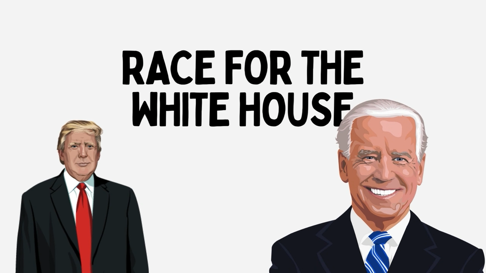

    
    
    
    
    
    

## Project Summary

Welcome to 'Race for the White House,' a highly acclaimed project from Harvard CS 171 that has earned a place in the prestigious Hall of Fame.
This repository contains html, javascript, css, and other supporting files to 
create a comprehensive exploration of the media's coverage of the 2024 United States Presidential Election. The data for 
this project is scraped from the Internet Archive's TV news archive, which is updated daily and contains millions of clips
from local, national, and international news networks. `labeled.csv` contains the cleaned closed captions from clips that 
mention 2024 presidential candidates, along with other data such as the date and network of the mention. Finally, the 
text from each caption was fed to a RoBERTa-based sentiment analysis model to label the mention as either positive or 
negative. The Race for the White House leverages this data to create unique, interesting visualizations that explore how
both coverage sentiment and volume differ across candidates and networks.

## File Structure

      ├── LICENSE
      ├── README.md
      ├── css                     #CSS folder for all styling files
            ├── style.css
            └── inspector.css
      ├── data                       
            └── labeled.csv       #Data file that stores candidate/network info, text, and label for each mention
      ├── favicon                
      ├── fonts                   #Stores all custom fonts, including CNN font for headers
      ├── img                     #Stores all image and video files used across the website
            ├── candidate_portraits
            ├── candidate_portraits_small
            ├── intro_page
            ├── networks 
            └── ...   
            
      └── js                      #Home of all javascript files for the site, to include visualization files as well as other styling and formatting

Please feel free to further explore each directory to find relevant files and documentation.

## Usage

- The `js` directory holds JavaScript files responsible for the website's functionality.
- CSS stylesheets reside within the `css` directory for styling HTML elements.
- The data utilized for this project are stored in the `data` directory.
- Any works in progress or draft files are placed in the `drafts` directory.
- Favicon files for the website are found in the `favicon` directory.
- Custom font files used for styling are stored in the `fonts` directory.
- Image and video files utilized across the website, to include candidate photos, network logos, and other visuals
are placed in the `img` directory.
- The `index.html` file serves as the HTML file for compiling the website.

## Contributing

We encourage others to further our work in this project by forking the repository, making changes, and creating a pull request. 
We just ask that you credit this original project in any future of this repository.

## License and Disclaimer

This project is licensed under MIT License. See the [LICENSE](LICENSE) file for details.

We do not own the rights to any of the video, audio, or images used in this project.
This project is for educational use only and may not be used for commercial purposes.
